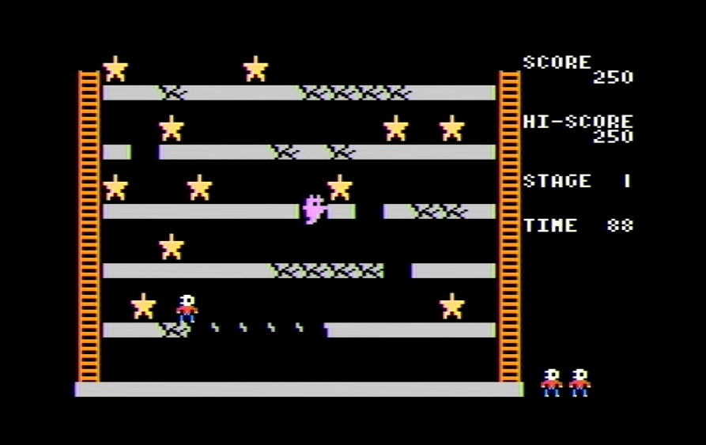

# Raspberry Pi Pico(+AV端子)版 CRACKY

全ての星を取るとクリアーです。  
ひびの入った床は、上を通ると消えるので1回しか通れません。

## キーボード操作

|操作|キー割り当て|
|-|-|
|移動|矢印キー(←→↑↓)|

## 接続

KenKenMkIISRさんのΡΟΠΗ for Raspberry Pi Pico(https://github.com/KenKenMkIISR/ROPE-RP2040)の「Raspberry Pi Pico用回路図」と同じです。(RP2040-Zeroには対応していません)
